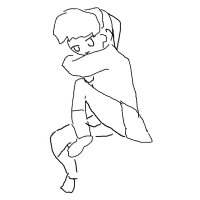
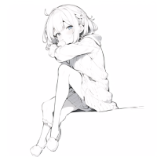
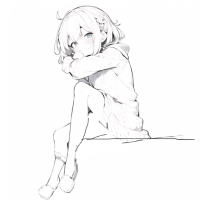
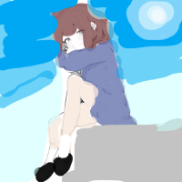
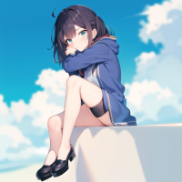

# テクニック・その他情報

## テクニック

### 落書きからイラスト作成

- /coloring で、image = 落書き画像、mode = Rakugaki でできるけど、微調整や色を細かく指定したい場合以下のような感じでできる

1. 落書きを用意する

    

    - 基本的に白地に黒で（薄い色に濃い色で）

    - この段階では小物や背景は書いても書かなくてもいい

2. /coloring で、image = 1.の画像、mode = Raku2Line で実行し、仮線画を生成

    

    - modelが表情とかに影響しやすい

3. 必要に応じて、仮線画を修正・追記する

    

    - 体や構図的がおかしい部分を直したり、背景を追記したり

    - これをさらにRaku2Lineしてもいい

4. 3.の線画ファイルをコピーして、色を乗せる

    **※必ず3.の未着色画像は取っておくこと！**

    

    - はみ出しや塗り残しはあまり影響しないので、バケツとか太いブラシでいい

    - 背景の色合い的な部分はここで塗ったほうが楽かも

    - あまり薄い色は結果に反映されないかも

5. /coloring で、image = 3.の線画、mode = Linedraw、colorref - 4.で塗った画像で実行して完成

    

    - modelは塗りに影響するので、けっこう重要

    - 色が反映されない場合、濃くしたり、その部分の周りとの差を強くするといいかも

### Discordの操作

- チャット欄で矢印キー上で、直前に入力したコマンドが出る

  - 過去のコマンドの青文字をクリックして、出る文字列をコピペでもOK

## その他情報

### Botについて

- サーバでもSigtoBotの個別チャットでも使える　個別がおすすめ

- 画像はローカルに全部保存してるけど、増えすぎたら消すかも

### おまけ

- 原神チャンネルでコードだけ入力するとURL投稿する機能がついている
  - 正規表現的には ```^[a-zA-Z0-9]{12}$```
